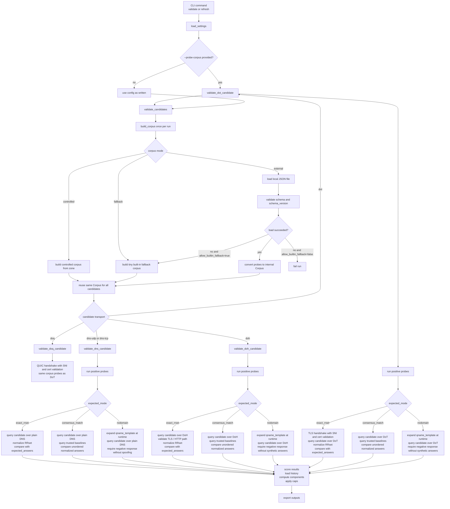

# How it works

Internals and reference for the resolver inventory crawler. For usage, see
the [README](README.md).

## Published pipeline

The [public-dns](https://github.com/disposable/public-dns) data repository
refreshes its published assets via GitHub Actions
(`.github/workflows/publish-data.yml`), daily on a schedule and manually via
`workflow_dispatch`:

1. `discover-and-split`: checks out the data repo and this crawler submodule,
   generates and validates the probe corpus, discovers candidates from the
   upstream sources, applies historical quarantine, and writes the validation
   shard inputs
2. `validate-shards`: runs a matrix job per shard where each runner validates
   one shard with configurable per-VM validation parallelism; candidates are
   dealt round-robin across shards so transports spread evenly
3. `merge-and-publish`: merges validated shards, materializes the output
   files, updates `meta/history.duckdb` (pushed to the `state` orphan branch),
   regenerates the README stats section, and commits changes; if the push is
   rejected because `main` moved, it rebases and retries

The `state` orphan branch carries run history (`history.duckdb`) and the
source fetch cache; validation shards read it so scoring sees prior runs
without locking the database.

## Configuration reference

Copy `configs/default.toml` and edit. Config format is **TOML** (stdlib
`tomllib`, no extra deps):

```toml
[[sources.dns]]
type = "publicdns_info"        # fetch from public-dns.info CSV
min_reliability = 0.50         # drop unstable entries below this reliability score

[[sources.dns]]
type = "manual"
path = "configs/manual-dns.txt"

[[sources.dns]]
type = "adguard"               # DNS, IPv4/IPv6 rows from the providers list

[[sources.dns]]
type = "paulmillr"             # ServerAddresses in the encrypted-dns profiles

[[sources.doh]]
type = "curl_wiki"             # scrape curl's DoH providers page

[[sources.doh]]
type = "adguard"               # fetch AdGuard providers markdown list

[[sources.doh]]
type = "dnscrypt"              # DoH stamps in the DNSCrypt public-resolvers list

[[sources.doh]]
type = "dnscrypt"              # same format, sibling list; label tags the source
url = "https://raw.githubusercontent.com/DNSCrypt/dnscrypt-resolvers/master/v3/parental-control.md"
label = "dnscrypt-parental-control"

[[sources.doh]]
type = "dnscrypt"
url = "https://raw.githubusercontent.com/DNSCrypt/dnscrypt-resolvers/master/v3/opennic.md"
label = "dnscrypt-opennic"

[[sources.doh]]
type = "paulmillr"             # https.ServerURLOrName in the encrypted-dns profiles

[[sources.doh]]
type = "dibdot"                # doh-domains.txt + IP-list hostname comments

[[sources.doh]]
type = "manual"
path = "configs/manual-doh.toml"

[[sources.dot]]
type = "adguard"               # parse tls:// rows from the same AdGuard list

[[sources.dot]]
type = "paulmillr"             # tls.ServerURLOrName in the encrypted-dns profiles

[[sources.dot]]
type = "dibdot"                # hostnames from the DoH-IP blocklist comments

[[sources.dot]]
type = "manual"
path = "configs/manual-dot.toml"

[[sources.doq]]
type = "adguard"               # parse quic:// rows from the same AdGuard list

[[sources.doq]]
type = "manual"
path = "configs/manual-doq.toml"

[validation]
rounds = 3
timeout_ms = 2000
parallelism = 50
doh_parallelism = 20
dot_parallelism = 15
doq_parallelism = 15
require_tcp_for_dns = false            # when true, accepted dns-udp results require
                                       # an accepted dns-tcp result on the same host:port
require_tls_valid_for_doh = true       # when false, DoH TLS failures are penalties
                                       # only instead of hard failures
require_tls_valid_for_dot = true       # same, for DoT
require_tls_valid_for_doq = true       # same, for DoQ
revalidation_stable_days = 0           # >0: resolvers with this many consecutive
                                       # accepted days get reduced probe rounds
revalidation_stable_rounds = 1         # rounds used for stable resolvers

# Non-scoring capability tags measured per resolver endpoint. Each check
# produces true/false/null in the result's `capabilities` object and never
# affects the score.
[validation.capabilities]
enabled = true
dnssec_sentinels = ["dnssec-failed.org.", "sigfail.verteiltesysteme.net."]
ecs_probe_qname = "www.google.com."
filter_domains = ["doubleclick.net.", "ads.yahoo.com.", "pornhub.com."]

[validation.dns_backend]
kind = "python"                       # default backend; "massdns" is optional
massdns_bin = "massdns"
hashmap_size = 2000
processes = 1
socket_count = 1
interval_ms = 0
predictable = true
flush = true
batch_max_queries = 50000
stderr_log_level = "debug"
fallback_to_python_on_error = true

[validation.corpus]
mode = "external"                     # "controlled", "fallback", or "external"
zone = "dns-test.example.net"         # controlled mode only
path = "tests/fixtures/probe-corpus-valid.json"
schema_version = 1
allow_builtin_fallback = false
strict = true

[scoring]
accept_min_score = 80
candidate_min_score = 60

[export]
formats = ["json", "text", "dnsdist"]
output_dir = "outputs/latest"
```

`publicdns_info` accepts an optional `min_reliability` setting. Entries with a
lower score are ignored before validation. The default is `0.50`.

## Optional MassDNS backend

Plain DNS validation supports two backends:

- `python` (default): existing dnspython probe path
- `massdns` (optional): batched subprocess path with streaming stdin/stdout pipes

DoH validation is unchanged and never uses MassDNS.

MassDNS phase-1 routing limitations:

- Only `dns-udp` probes on port `53` are routed to MassDNS.
- `dns-tcp` and non-53 plain DNS probes automatically use the python backend.
- `doh` probes always use the existing DoH path.
- `dot` probes always use the DoT path (`dns.asyncquery.tls`); MassDNS cannot do TLS.
- `doq` probes always use the DoQ path (`dns.asyncquery.quic`, requires `aioquic`).
- `latency_ms` on MassDNS can have lower fidelity depending on output fields.

Install MassDNS before enabling it:

```bash
massdns --help
```

Start with conservative tuning in CI. Increase `hashmap_size` (`-s`) only
after validating memory and throughput tradeoffs in your environment.

## Corpus modes

| Mode | Description |
|---|---|
| `controlled` | Uses your own authoritative zone with fixed RRs. Best accuracy. Requires `zone` to be set. |
| `external` | Loads a local JSON corpus file, validates schema/version, and converts it into validator probes. Requires `path`. |
| `fallback` | Uses a tiny built-in low-variance fallback corpus. Intended as an emergency/dev fallback, not the main path. |

### External corpus example

```toml
[validation.corpus]
mode = "external"
path = "tests/fixtures/probe-corpus-valid.json"
schema_version = 1
allow_builtin_fallback = false
strict = true
```

Minimal required external corpus shape:

```json
{
  "schema_version": 1,
  "corpus_version": "test-001",
  "generated_at": "2026-04-04T00:00:00Z",
  "probes": [
    {
      "id": "pos-example-a",
      "kind": "positive_consensus",
      "qname": "example.com.",
      "qtype": "A",
      "expected_mode": "baseline_match"
    },
    {
      "id": "neg-generated-a",
      "kind": "negative_generated",
      "qname_template": "{uuid}.com.",
      "qtype": "A",
      "expected_mode": "nxdomain"
    }
  ]
}
```

## Validation flow

The corpus is built or loaded once per validation run, then reused for every
candidate in that run.



`validate_dns_candidate`, `validate_doh_candidate`, `validate_dot_candidate`, and
`validate_doq_candidate` all consume
the same prebuilt corpus, but they execute transport-specific query code. `exact_rrset` probes
compare directly against pinned answers, `consensus_match` probes compare the candidate against
the configured trusted baseline resolvers, and `negative_generated` probes keep the template in
the corpus and expand a fresh query name at execution time. DoT/DoQ candidates may use IP literals
or hostnames; hostname endpoints resolve once per validation window (or use configured
`bootstrap_ipv4`/`bootstrap_ipv6` addresses) and validate the certificate against
`tls_server_name` (defaulting to the host).

### Validation reason codes

| Code | Meaning |
|---|---|
| `nxdomain_spoofing` | Resolver returned NOERROR for a nonexistent name |
| `tls_name_mismatch` | DoH/DoT/DoQ TLS certificate does not match the expected server name |
| `tls_error` | DoH/DoT/DoQ TLS handshake or certificate validation failed |
| `timeout_rate_high` | More than 50% of probes timed out |
| `latency_p95_high` | 95th-percentile latency exceeds 2 s |
| `unexpected_nxdomain` | Resolver returned NXDOMAIN for a name that should exist |
| `unexpected_rcode` | Resolver returned an unexpected RCODE |
| `udp_only` | Only UDP probes ran (no TCP confirmation) |

## Scoring system

The validation result includes a composite `score` (0-100) that reflects resolver quality, as well as a separate `confidence_score` (0-100) that reflects how certain we are about the measurement.

### Score components

The final score is a weighted sum of four components:

| Component | Weight | Description |
|-----------|--------|-------------|
| `correctness` | 0-50 | Penalties for DNS/TLS errors, answer mismatches, NXDOMAIN spoofing |
| `availability` | 0-20 | Based on probe success rate (100% = 20 pts, 50% = 10 pts) |
| `performance` | 0-20 | Latency penalties for p50, p95, and jitter thresholds |
| `history` | 0-10 | Rewards sustained stability, penalizes flapping and recent failures |

Component scores are included in the JSON export as `score_breakdown`.

### Performance penalty thresholds

**p50 (median) latency:**
- >100 ms: -3 points
- >300 ms: -8 points
- >700 ms: -18 points
- >1500 ms: -30 points

**p95 (tail) latency:**
- >400 ms: -2 points
- >800 ms: -6 points
- >1500 ms: -12 points
- >2500 ms: -20 points

**Jitter (p95 - p50):**
- >150 ms: -2 points
- >400 ms: -6 points
- >900 ms: -12 points

Reason codes: `latency_high`, `latency_very_high`, `latency_p95_high`, `latency_jitter_high`

### Hard-fail correctness issues

Severe correctness problems cap the final score at <=59 regardless of other factors:
- `nxdomain_spoofing`
- `tls_name_mismatch`
- `answer_mismatch`
- `unexpected_rcode_suspicious` (REFUSED/SERVFAIL patterns)

### History-based caps

Without sufficient observation history, scores are capped:
- <3 runs observed: max 90
- 3-6 runs observed: max 95
- 7-13 runs observed: max 98
- 14+ runs: no cap from history

### Score of 100 requirements

A perfect score of 100 requires ALL of the following:
- No correctness issues (no penalties)
- No performance penalties (low latency)
- 100% probe success rate
- >=14 observed runs in history
- <=2 status flaps in 30 days
- No consecutive failure days
- Confidence score >=90

### Confidence score

The `confidence_score` (0-100) is computed separately and reflects measurement certainty, not resolver quality:
- Probe count (max 30): more probes = higher confidence
- Latency samples (max 20): more samples = higher confidence
- Historical observations (max 35): more runs = higher confidence
- Source metadata (max 15): reliability data present = higher confidence

Missing source reliability reduces confidence but does not penalize the quality score.

### Exported score fields

JSON exports include these new fields:

```json
{
  "score": 87,
  "score_breakdown": {
    "correctness": 50,
    "availability": 18,
    "performance": 12,
    "history": 7
  },
  "confidence_score": 65,
  "score_caps_applied": ["insufficient_history"],
  "derived_metrics": {
    "p50_latency_ms": 45.2,
    "p95_latency_ms": 120.5,
    "jitter_ms": 75.3,
    "latency_sample_count": 10,
    "runs_seen_30d": 5,
    "runs_seen_7d": 3,
    "flaps_30d": 0,
    "consecutive_success_days": 5,
    "consecutive_fail_days": 0
  },
  "capabilities": {
    "dnssec_validating": true,
    "ecs_support": false,
    "filters_detected": null
  }
}
```

`capabilities` values are `true`, `false`, or `null` (inconclusive). They are
measured by the `[validation.capabilities]` checks and never affect the score.

## Local reproduction

From the data repository checkout (parent of `crawler/`):

```bash
git submodule update --init --recursive

cd crawler
uv sync --group dev

uv run resolver-inventory generate-probe-corpus \
  --config configs/probe-corpus.toml \
  --output ../probe-corpus

uv run resolver-inventory validate-probe-corpus \
  --config configs/probe-corpus.toml \
  --input ../probe-corpus/probe-corpus.json

uv run resolver-inventory refresh \
  --config configs/default.toml \
  --probe-corpus ../probe-corpus/probe-corpus.json \
  --output ../_build
```

For server-side end-to-end runs without GitHub Actions stages, use
`scripts/local-deploy.sh` in the data repository. It supports per-run
overrides such as `--validation-parallelism 12` and `--validate-jobs 10`.
Large JSON outputs can also be chunked with `--split-json-max-bytes`
(default in local deploy is `40000000` bytes).

Example:

```bash
bash scripts/local-deploy.sh \
  --validation-parallelism 8 \
  --validate-jobs 4
```
