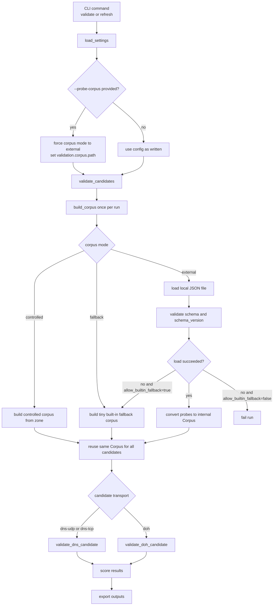

# resolver-inventory

Aggregate, validate, score, and export public DNS and DoH resolvers.

## Features

- **Multi-source discovery** – plain DNS from public-dns.info, DoH from curl wiki and AdGuard providers, manual seed files
- **Full endpoint metadata** – DoH records preserve URL, host, port, path, TLS server name, bootstrap IPs, and provenance
- **Active validation** – reachability, NXDOMAIN fidelity, latency, consistency, TLS validity
- **Pluggable test corpus** – controlled zone, local external JSON corpus, or tiny built-in fallback
- **Scored output** – `accepted` / `candidate` / `rejected` with machine-readable reason codes
- **Multiple export formats** – JSON, plain text, dnsdist config, Unbound forward-zone
- **Deterministic CI** – required PR checks use local ephemeral fixtures, never public resolvers

## Quick start

```bash
# Install with uv
uv sync --group dev

# Full pipeline (discover → validate → export)
resolver-inventory refresh --config configs/default.toml --output outputs/latest

# Full pipeline with an external local probe corpus
resolver-inventory refresh \
  --config configs/default.toml \
  --probe-corpus tests/fixtures/probe-corpus-valid.json \
  --output outputs/latest

# Validate a corpus file before using it
resolver-inventory validate-probe-corpus --input tests/fixtures/probe-corpus-valid.json

# Inspect exported files
cat outputs/latest/accepted.json
cat outputs/latest/resolvers.txt
cat outputs/latest/dnsdist.conf
```

## CLI

```
resolver-inventory discover   # gather raw candidates
resolver-inventory validate   # run probes, emit scored records
resolver-inventory refresh    # full pipeline (discover + validate + export)
resolver-inventory validate-probe-corpus --input FILE
resolver-inventory export json     [--input FILE] [--output FILE]
resolver-inventory export text     [--input FILE] [--output FILE]
resolver-inventory export dnsdist  [--input FILE] [--output FILE]
resolver-inventory export unbound  [--input FILE] [--output FILE]
```

Global flags: `--config FILE`, `--log-level {DEBUG,INFO,WARNING,ERROR}`

Validation commands also support `--probe-corpus FILE`. When provided, the CLI sets `validation.corpus.mode = "external"` and loads probes from that local JSON file.

## Library API

```python
from resolver_inventory.sources import discover_candidates
from resolver_inventory.validate import validate_candidates
from resolver_inventory.export import export_dnsdist, export_json
from resolver_inventory.settings import load_settings

settings = load_settings("configs/default.toml")
candidates = discover_candidates(settings)
results = validate_candidates(candidates, settings)
print(export_json(results))
```

## Configuration

Copy `configs/default.toml` and edit. Config format is **TOML** (stdlib `tomllib`, no extra deps):

```toml
[[sources.dns]]
type = "publicdns_info"        # fetch from public-dns.info CSV

[[sources.dns]]
type = "manual"
path = "configs/manual-dns.txt"

[[sources.doh]]
type = "curl_wiki"             # scrape curl's DoH providers page

[[sources.doh]]
type = "adguard"               # fetch AdGuard providers JSON

[[sources.doh]]
type = "manual"
path = "configs/manual-doh.toml"

[validation]
rounds = 3
timeout_ms = 2000
parallelism = 50

[validation.corpus]
mode = "external"                     # "controlled", "fallback", or "external"
zone = "dns-test.example.net"         # controlled mode only
path = "tests/fixtures/probe-corpus-valid.json"
schema_version = 1
allow_builtin_fallback = false
strict = true

[scoring]
accept_min_score = 80
candidate_min_score = 60

[export]
formats = ["json", "text", "dnsdist"]
output_dir = "outputs/latest"
```

### Corpus modes

| Mode | Description |
|---|---|
| `controlled` | Uses your own authoritative zone with fixed RRs. Best accuracy. Requires `zone` to be set. |
| `external` | Loads a local JSON corpus file, validates schema/version, and converts it into validator probes. Requires `path`. |
| `fallback` | Uses a tiny built-in low-variance fallback corpus. Intended as an emergency/dev fallback, not the main path. |

### External corpus example

```toml
[validation.corpus]
mode = "external"
path = "tests/fixtures/probe-corpus-valid.json"
schema_version = 1
allow_builtin_fallback = false
strict = true
```

Minimal required external corpus shape:

```json
{
  "schema_version": 1,
  "corpus_version": "test-001",
  "generated_at": "2026-04-04T00:00:00Z",
  "probes": [
    {
      "id": "pos-example-a",
      "kind": "positive_consensus",
      "qname": "example.com.",
      "qtype": "A",
      "expected_mode": "baseline_match"
    },
    {
      "id": "neg-generated-a",
      "kind": "negative_generated",
      "qname_template": "{uuid}.com.",
      "qtype": "A",
      "expected_mode": "nxdomain"
    }
  ]
}
```

## Validation Flow

The corpus is built or loaded once per validation run, then reused for every candidate in that run.



### Validation reason codes

| Code | Meaning |
|---|---|
| `nxdomain_spoofing` | Resolver returned NOERROR for a nonexistent name |
| `tls_name_mismatch` | DoH TLS certificate does not match the expected server name |
| `timeout_rate_high` | More than 50% of probes timed out |
| `latency_p95_high` | 95th-percentile latency exceeds 2 s |
| `unexpected_nxdomain` | Resolver returned NXDOMAIN for a name that should exist |
| `unexpected_rcode` | Resolver returned an unexpected RCODE |
| `udp_only` | Only UDP probes ran (no TCP confirmation) |

## Development

```bash
# Install dev dependencies
uv sync --group dev

# Run all tests
uv run pytest

# Run only unit tests (fast, no I/O)
uv run pytest tests/unit

# Run only integration tests (local fixtures, no public network)
uv run pytest -m integration tests/integration

# Lint
uv run ruff check .
uv run ruff format .

# Type-check (Python 3.14.x)
uv run pyright

# Build the package
uv build
```

## CI

- **`ci.yml`** – lint, type-check, unit tests (matrix: Linux/macOS/Windows), integration tests, build
- **`release.yml`** – builds and publishes to PyPI via trusted publishing on `v*` tags
- **`refresh.yml`** – nightly pipeline run + optional non-blocking canary network tests

Required PR checks never touch public resolvers.

## License

MIT © disposable
