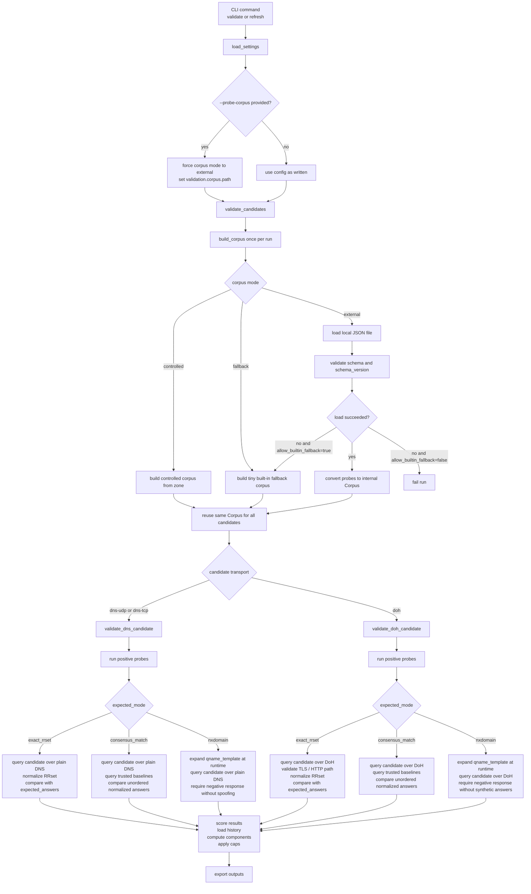

# Public DNS and DoH resolver crawler

Aggregate, validate, score, and export public DNS and DoH resolvers.

## Features

- **Multi-source discovery** - plain DNS from public-dns.info, DoH from curl wiki and AdGuard provider lists, manual seed files
- **Pre-validation filtering records** - source and normalization drops are exported as `filtered.json` with reason codes
- **Full endpoint metadata** - DoH records preserve URL, host, port, path, TLS server name, bootstrap IPs, and provenance
- **Active validation** - reachability, NXDOMAIN fidelity, latency, consistency, TLS validity
- **Pluggable test corpus** - controlled zone, local external JSON corpus, or tiny built-in fallback
- **Scored output** - component-based scoring (correctness, availability, performance, history) with separate confidence score, score caps, and derived metrics
- **Multiple export formats** - JSON, plain text, dnsdist config, Unbound forward-zone

## Source feeds

Default discovery sources configured in `configs/default.toml`:

- `publicdns_info` (plain DNS): <https://public-dns.info/nameservers.csv>
  - default filter: `min_reliability = 0.50`
- `curl_wiki` (DoH): <https://raw.githubusercontent.com/wiki/curl/curl/DNS-over-HTTPS.md>
- `adguard` (DoH): <https://raw.githubusercontent.com/AdguardTeam/KnowledgeBaseDNS/master/docs/general/dns-providers.md>
- `manual` seeds (local files):
  - `configs/manual-dns.txt`
  - `configs/manual-doh.toml`

## Quick start

```bash
# Install with uv
uv sync --group dev

# Full pipeline (discover → validate → export)
uv run resolver-inventory refresh --config configs/default.toml --output outputs/latest

# Full pipeline with an external local probe corpus
uv run resolver-inventory refresh \
  --config configs/default.toml \
  --probe-corpus tests/fixtures/probe-corpus-valid.json \
  --output outputs/latest

# Validate a corpus file before using it
uv run resolver-inventory validate-probe-corpus --input tests/fixtures/probe-corpus-valid.json

# Inspect exported files
cat outputs/latest/accepted.json
cat outputs/latest/resolvers.txt
cat outputs/latest/dnsdist.conf
```

## CLI

```
resolver-inventory discover   # gather raw candidates
resolver-inventory validate   # run probes, emit scored records
resolver-inventory refresh    # full pipeline (discover + validate + export)
resolver-inventory split-candidates     # deterministic candidate sharding
resolver-inventory materialize-results  # merge validated shards and export outputs
resolver-inventory validate-probe-corpus --input FILE
resolver-inventory generate-probe-corpus [--config FILE] [--seed-file FILE] [--output DIR]
resolver-inventory export json     [--input FILE] [--output FILE]
resolver-inventory export text     [--input FILE] [--output FILE]
resolver-inventory export dnsdist  [--input FILE] [--output FILE]
resolver-inventory export unbound  [--input FILE] [--output FILE]
```

Global flags: `--config FILE`, `--log-level {DEBUG,INFO,WARNING,ERROR}`.

Validation commands also support `--probe-corpus FILE` and `--validation-parallelism N`. When `--probe-corpus` is provided, the CLI sets `validation.corpus.mode = "external"` and loads probes from that local JSON file.
JSON exports are written in compact form and sorted deterministically by endpoint identity to keep diffs stable.
Use `--split-json-max-bytes N` on `refresh`, `materialize-results`, or `export json` to split large JSON outputs into `.part-XXXX` files.

### Staged pipeline commands

For multi-VM flows (for example GitHub Actions matrix validation), use:

1. `discover --output candidates.json --filtered-output filtered.json`
2. `split-candidates --input candidates.json --output-dir chunks --shards 10`
3. `validate --input chunks/chunk-XX.json --output shard-XX.json`
4. `materialize-results --inputs-glob "shards/*.json" --filtered-input filtered.json --output outputs/latest`

### Exported file meanings

- `accepted.json` - resolvers with status `accepted`
- `candidate.json` - resolvers with status `candidate`
- `rejected.json` - resolvers with status `rejected`; only failed probes are kept, and `all_probes_failed` is set when every probe failed
- `filtered.json` - candidates dropped before validation, including source filtering, normalization failures, duplicates, and historical quarantine
- `resolvers.txt` - accepted plain DNS resolvers only, as `host:port`
- `resolvers-doh.txt` - accepted DoH resolvers only, as full HTTPS endpoints
- `dnsdist.conf` - dnsdist backends for all non-rejected resolvers
- `unbound-forward.conf` - accepted plain DNS resolvers rendered as Unbound forward zones

If `--split-json-max-bytes` is used, large JSON outputs are written as `name.part-XXXX.json` chunks instead of a single large file.

## Library API

```python
from resolver_inventory.sources import discover_candidates
from resolver_inventory.validate import validate_candidates
from resolver_inventory.export import export_dnsdist, export_json
from resolver_inventory.settings import load_settings

settings = load_settings("configs/default.toml")
candidates = discover_candidates(settings)
results = validate_candidates(candidates, settings)
print(export_json(results))
```

## Configuration

Copy `configs/default.toml` and edit. Config format is **TOML** (stdlib `tomllib`, no extra deps):

```toml
[[sources.dns]]
type = "publicdns_info"        # fetch from public-dns.info CSV
min_reliability = 0.50         # drop unstable entries below this reliability score

[[sources.dns]]
type = "manual"
path = "configs/manual-dns.txt"

[[sources.doh]]
type = "curl_wiki"             # scrape curl's DoH providers page

[[sources.doh]]
type = "adguard"               # fetch AdGuard providers markdown list

[[sources.doh]]
type = "manual"
path = "configs/manual-doh.toml"

[validation]
rounds = 3
timeout_ms = 2000
parallelism = 50

[validation.corpus]
mode = "external"                     # "controlled", "fallback", or "external"
zone = "dns-test.example.net"         # controlled mode only
path = "tests/fixtures/probe-corpus-valid.json"
schema_version = 1
allow_builtin_fallback = false
strict = true

[scoring]
accept_min_score = 80
candidate_min_score = 60

[export]
formats = ["json", "text", "dnsdist"]
output_dir = "outputs/latest"
```

`publicdns_info` accepts an optional `min_reliability` setting. Entries with a lower score are ignored before validation. The default is `0.50`.

### Corpus modes

| Mode | Description |
|---|---|
| `controlled` | Uses your own authoritative zone with fixed RRs. Best accuracy. Requires `zone` to be set. |
| `external` | Loads a local JSON corpus file, validates schema/version, and converts it into validator probes. Requires `path`. |
| `fallback` | Uses a tiny built-in low-variance fallback corpus. Intended as an emergency/dev fallback, not the main path. |

### External corpus example

```toml
[validation.corpus]
mode = "external"
path = "tests/fixtures/probe-corpus-valid.json"
schema_version = 1
allow_builtin_fallback = false
strict = true
```

Minimal required external corpus shape:

```json
{
  "schema_version": 1,
  "corpus_version": "test-001",
  "generated_at": "2026-04-04T00:00:00Z",
  "probes": [
    {
      "id": "pos-example-a",
      "kind": "positive_consensus",
      "qname": "example.com.",
      "qtype": "A",
      "expected_mode": "baseline_match"
    },
    {
      "id": "neg-generated-a",
      "kind": "negative_generated",
      "qname_template": "{uuid}.com.",
      "qtype": "A",
      "expected_mode": "nxdomain"
    }
  ]
}
```

## Validation Flow

The corpus is built or loaded once per validation run, then reused for every candidate in that run.



`validate_dns_candidate` and `validate_doh_candidate` both consume the same prebuilt corpus,
but they execute transport-specific query code. `exact_rrset` probes compare directly against
pinned answers, `consensus_match` probes compare the candidate against the configured trusted
baseline resolvers, and `negative_generated` probes keep the template in the corpus and expand a
fresh query name at execution time.

### Validation reason codes

| Code | Meaning |
|---|---|
| `nxdomain_spoofing` | Resolver returned NOERROR for a nonexistent name |
| `tls_name_mismatch` | DoH TLS certificate does not match the expected server name |
| `timeout_rate_high` | More than 50% of probes timed out |
| `latency_p95_high` | 95th-percentile latency exceeds 2 s |
| `unexpected_nxdomain` | Resolver returned NXDOMAIN for a name that should exist |
| `unexpected_rcode` | Resolver returned an unexpected RCODE |
| `udp_only` | Only UDP probes ran (no TCP confirmation) |

## Scoring System

The validation result includes a composite `score` (0-100) that reflects resolver quality, as well as a separate `confidence_score` (0-100) that reflects how certain we are about the measurement.

### Score Components

The final score is a weighted sum of four components:

| Component | Weight | Description |
|-----------|--------|-------------|
| `correctness` | 0-50 | Penalties for DNS/TLS errors, answer mismatches, NXDOMAIN spoofing |
| `availability` | 0-20 | Based on probe success rate (100% = 20 pts, 50% = 10 pts) |
| `performance` | 0-20 | Latency penalties for p50, p95, and jitter thresholds |
| `history` | 0-10 | Rewards sustained stability, penalizes flapping and recent failures |

Component scores are included in the JSON export as `score_breakdown`.

### Performance Penalty Thresholds

**p50 (median) latency:**
- >100 ms: -3 points
- >300 ms: -8 points
- >700 ms: -18 points
- >1500 ms: -30 points

**p95 (tail) latency:**
- >400 ms: -2 points
- >800 ms: -6 points
- >1500 ms: -12 points
- >2500 ms: -20 points

**Jitter (p95 - p50):**
- >150 ms: -2 points
- >400 ms: -6 points
- >900 ms: -12 points

Reason codes: `latency_high`, `latency_very_high`, `latency_p95_high`, `latency_jitter_high`

### Hard-Fail Correctness Issues

Severe correctness problems cap the final score at ≤59 regardless of other factors:
- `nxdomain_spoofing`
- `tls_name_mismatch`
- `answer_mismatch`
- `unexpected_rcode_suspicious` (REFUSED/SERVFAIL patterns)

### History-Based Caps

Without sufficient observation history, scores are capped:
- <3 runs observed: max 90
- 3-6 runs observed: max 95
- 7-13 runs observed: max 98
- 14+ runs: no cap from history

### Score of 100 Requirements

A perfect score of 100 requires ALL of the following:
- No correctness issues (no penalties)
- No performance penalties (low latency)
- 100% probe success rate
- ≥14 observed runs in history
- ≤2 status flaps in 30 days
- No consecutive failure days
- Confidence score ≥90

### Confidence Score

The `confidence_score` (0-100) is computed separately and reflects measurement certainty, not resolver quality:
- Probe count (max 30): more probes = higher confidence
- Latency samples (max 20): more samples = higher confidence
- Historical observations (max 35): more runs = higher confidence
- Source metadata (max 15): reliability data present = higher confidence

Missing source reliability reduces confidence but does not penalize the quality score.

### Exported Score Fields

JSON exports include these new fields:

```json
{
  "score": 87,
  "score_breakdown": {
    "correctness": 50,
    "availability": 18,
    "performance": 12,
    "history": 7
  },
  "confidence_score": 65,
  "score_caps_applied": ["insufficient_history"],
  "derived_metrics": {
    "p50_latency_ms": 45.2,
    "p95_latency_ms": 120.5,
    "jitter_ms": 75.3,
    "latency_sample_count": 10,
    "runs_seen_30d": 5,
    "runs_seen_7d": 3,
    "flaps_30d": 0,
    "consecutive_success_days": 5,
    "consecutive_fail_days": 0
  }
}
```

## Development

```bash
# Install dev dependencies
uv sync --group dev

# Run all tests
uv run pytest

# Run only unit tests (fast, no I/O)
uv run pytest tests/unit

# Run only integration tests (local fixtures, no public network)
uv run pytest -m integration tests/integration

# Lint
uv run ruff check .
uv run ruff format .

# Type-check (Python 3.13.x)
uv run pyright

# Build the package
uv build
```

All local test commands in this repository are expected to run through `uv run ...` after
`uv sync --group dev`. No manual `PYTHONPATH=src` bootstrap is required.

## Probe Corpus Docker Flow

The probe corpus generator can run in Docker and write its artifacts into
`outputs/probe-corpus/`.

```bash
# Build the generator image
make probe-corpus-build-image

# Generate the corpus into outputs/probe-corpus/
make probe-corpus-generate

# Validate the generated JSON corpus
make probe-corpus-validate

# Run the normal resolver refresh with that generated corpus
make refresh-with-probe-corpus
```

Equivalent direct Docker invocation:

```bash
mkdir -p outputs/probe-corpus
docker build -f docker/probe-corpus.Dockerfile -t resolver-inventory-probe-corpus .
docker run --rm -v "$PWD/outputs/probe-corpus:/out" resolver-inventory-probe-corpus
uv run resolver-inventory validate-probe-corpus \
  --config configs/probe-corpus.toml \
  --input outputs/probe-corpus/probe-corpus.json \
  --schema-version 2
uv run resolver-inventory refresh \
  --config configs/default.toml \
  --probe-corpus outputs/probe-corpus/probe-corpus.json \
  --output outputs/latest
```

## CI

- **`ci.yml`** - lint, type-check, unit tests (matrix: Linux/macOS/Windows), integration tests, build
- **`release.yml`** - builds and publishes to PyPI via trusted publishing on `v*` tags
- **`refresh.yml`** - scheduled/manual multi-job pipeline:
  1. build the Docker probe-corpus generator
  2. generate `outputs/probe-corpus/probe-corpus.json`
  3. validate the generated corpus
  4. pass `probe-corpus` to the refresh job as a workflow artifact
  5. run `refresh --probe-corpus ...`
  6. upload `refreshed-resolver-data`
  7. run optional non-blocking network canaries

Required PR checks never touch public resolvers.

## History and reporting scripts

These helper scripts are used by the parent data repo workflow and are intentionally separate from the main CLI:

- `scripts/apply_history_quarantine.py` - drops currently quarantined plain DNS hosts from discovered candidates and appends `historical_dns_quarantine` entries to `filtered.json`
- `scripts/update_history.py` - updates `meta/history.duckdb` from `validated.json`, `filtered.json`, and build metadata
- `scripts/generate_stats_report.py` - regenerates the `<!-- GENERATED_STATS_* -->` README statistics section from history data
- `scripts/analyze_scores.py` - analyzes score distribution from validation results and can compare before/after runs

## License

MIT © disposable
